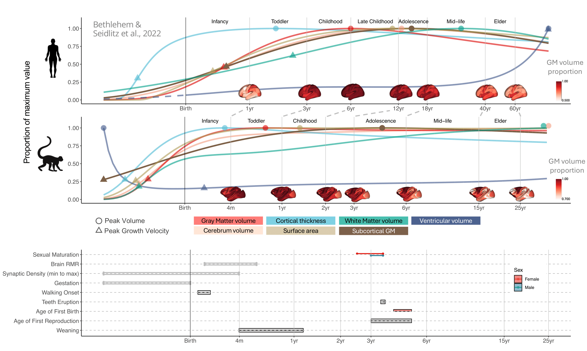

# Macaque Charts Figures Code

This repo contains code to replicate the figures in Brain Charts for the Rhesus Macaque Lifespan.

Lifespan models were fit using Generalized Additive Models for Location, Scale, and Shape (GAMLSS). A wrapper for the R implementation of GAMLSS was used specifically for modeling age-related brain changes over the lifespan, first built and used by Richard Bethlehem and Jakob Seidlitz for Brain Charts for the Human Lifespan (Bethlehem & Seidlitz, 2022). [See the base code here.](https://github.com/brainchart/Lifespan)

  
  

### Figure 1: Global tissue type lifespan curves

- Demographic information boxplots
- Tissue type scatterplots
- Tissue type normalized centile curves
- Tissue type site specific curves
- Tissue type growth plots

### Figure 2: Global morphometric lifespan curves and growth surfaces

- Morphometric scatterplots
- Morphometric centile curves
- Morphometric growth rates
- Surface plots of regional growth rates at total gray volume peak

### Figure 3: Cross-species lifespan curves

- Human growth charts (Bethlehem & Seidlitz et. al., 2022)
- Macaque growth charts
- Surface plots of proportional regional growth

### Figure 4: Regional peaks and Meta-analysis

- Macaque regional peak
- Human regional peak
- Difference peak maps
- Cytoarchitecture summary
- Neurosynth growth decoding

### Figure 5: Cross-species mapper

- Example usage of exploring human and macaque [regional growth charts across the lifespan](https://interspeciesmap.childmind.org/)

### References

Bethlehem, R. A. I. et al. Brain charts for the human lifespan. Nature 604, 525–533 (2022).
Alldritt, S. et al. Brain Charts for the Rhesus Macaque Lifespan. Neuroscience (2024).

